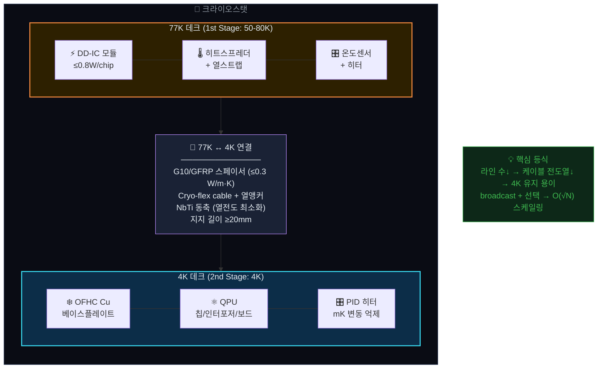

<div align="center">

<!-- Blueprint Header -->


<!-- Topic Lines -->


<br/>

<!-- Badges -->


</div>

> **대상 독자:** 반도체 공정/회로 설계 경험이 있고, TCAD 시뮬레이션·PDK 설계 규칙·크라이오 패키징·RF 회로에 대한 배경지식을 보유한 엔지니어·연구자.
>
> 본 문서는 BQB 플랫폼의 설계 결정 근거와 정량적 스펙을 제안서 원문 기반으로 정리한 엔지니어링 레퍼런스이다.


## 📑 목차

<div align="center">

| # | 주제 | 핵심 내용 |
|:---:|------|----------|
| 1 | [오차 예산 분해](#1--오차-예산-분해-체계) | N_phys → N_op → N_link 전환율, 연차별 15개 KPI |
| 2 | [Triple-Wall QBQ 설계 규칙](#2--triple-wall-qbq-설계-규칙) | Wall-1/2/3 PDK 구현, 설계 노브, 바이어스 운용 |
| 3 | [DD-IC 회로 블록 아키텍처](#3--77k-dd-ic-회로-블록-아키텍처) | LO-PLL/DCO/TDC/시퀀서, broadcast+선택 |
| 4 | [Split-Stage 패키징 열설계](#4--split-stage-패키징-열설계) | 2-Deck 지그, 77K↔4K 열회로, SI 스펙 |
| 5 | [폐루프 수렴 정량적 모델](#5--폐루프-수렴의-정량적-모델) | Poisson 수율, Generate→Verify→Correct |
| 6 | [연차별 KPI 매트릭스](#6--연차별-kpi-진화-매트릭스) | TRL 3→5, 5개년 정량 체크포인트 |
| 7 | [위험관리 및 대응전략](#7--위험관리-및-대응전략) | 8대 기술 리스크 + 조기 검증 전략 |

</div>

---


### 🏗️ 전체 아키텍처 오버뷰


## 1. 📐 오차 예산 분해 체계: N_phys → N_op → N_link

대규모 배열 확장의 실질적 병목은 물리적 사이트 수(N_phys)가 아니라, 이를 운용 가능(N_op)하고 얽힘 연결(N_link)할 수 있는 **전환율**이다.


### 1.2 연차별 핵심 KPI 테이블

<div align="center">

| 지표 | 1차 | 2차 | 3차 | 4차 | 5차 |
|------|-----|-----|-----|-----|-----|
| 배열 규모 | 단일~소수 | 2×2 | 4×4 | 8×8 | 16×16 |
| overlay (nm) | ≤50 | ≤35 | ≤25 | ≤20 | ≤15 |
| outlier (%) | 기준정의 | ≤5 | ≤3 | ≤2 | ≤1 |
| F1q | 기준확립 | ≥0.99 | 0.95~0.99 | ≥0.99 | ≥0.999 |
| F2q | 기준확립 | ≥0.90 | ≥0.95 | ≥0.98 | ≥0.99 |
| 얽힘 링크 (쌍) | 0 | ≥1 | ≥4 | ≥8 | ≥16 |
| 사이트 수율 | — | 분리보고 | ≥95% | ≥97% | ≥99% |
| 어레이 수율 | — | 분리보고 | ≥50% | ≥60% | ≥70% |
| T2 (CPMG) | 기준선 | 개선 | 개선 | 개선 | ≥1 s |
| ΔR/R | ≤10% | ≤7% | ≤5% | ≤3% | ≤2% |
| 누설전류 증가 | ≤2× | ≤1.5× | ≤1.2× | ≤1.1× | ≤1.1× |
| 단일이온 검출 | 방식확정 | ≥99% | ≥99% | ≥99% | ≥99% |

</div>

---


## 2. 🛡️ Triple-Wall QBQ 설계 규칙

### 2.1 3중 벽 구조 및 PDK 매핑


<div align="center">

| 구성(벽) | PDK 구현(예) | 설계 노브(운용) | KPI 기여 |
|---------|------------|---------------|---------|
| **Wall-1: 외곽 격리벽** | STI 기반 isolation moat(타일 경계) 및 keep-out 구조 | moat 폭/간격, 타일 pitch, 금속/비아 keep-out | 타일 간 기판 커플링/크로스토크 감소, overlay 기준 경계 확보 |
| **Wall-2: 전기적 실드웰** | T3(True Triple Well) isolation으로 back-gate/웰 도메인 분리 + quiet guard ring + 전용 리턴/실드 | V_BG_i(타일 back-gate), V_well_shield, guard ring bias(V_SSQ), 라인 RC 필터/차폐 | \|∇E\| 및 1/f 전하잡음 민감도 저감, detune/tune-in 안정, 77K DD-IC 근접 노이즈 내성 향상 |
| **Wall-3: BQB-B 매립 장벽** | BQB-B(매립 장벽/템플릿 층)로 확산 차단 및 깊이 창 정의, implant window self-alignment | 장벽 깊이/두께, 개구 CD/형상, 저열예산 활성화 파형 | 채널링 tail/outlier 억제, σ_xy/σ_z 공정창 확대, BEOL/금속 열예산 안전성 강화 |

</div>

### 2.2 바이어스 운용 규칙 (권장, 77K 근접 제어 환경)

```
V_BG_i (타일 back-gate)
  → DC로 천천히 스윕/고정 (동적 스위칭 지양)
  → 77K 스테이지에서 RC 저역통과(또는 feedthrough 필터)로 노이즈 유입 차단

T3 실드웰 + guard ring
  → quiet reference(V_SSQ)에 연결
  → 디지털 리턴(V_SSD)과 star-point에서만 합류
  → DD-IC 스위칭 전류 리턴이 Q 주변으로 흐르지 않도록 함

타일 단위 V_BG_i 분할
  → detune/tune-in(선택성) 및 전하환경 트림을 공통모드화
  → 배열 확장 시 캘리브레이션 테이블 재사용성 향상
  → outlier 민감도 완화
```

### 2.3 주요 리스크 및 대응

> **기생 커패시턴스/면적 증가:** 다중 벽(가드링/격리)로 C_par가 증가할 수 있으므로, 타일 단위 RC/크로스토크 모델을 구축하고 배선/구동(DD 펄스) 조건을 공동 최적화한다.
>
> **응력/계면 트랩 증가:** 벽 경계/식각/패시베이션 조건에 따라 Dit 및 스펙트럴 디퓨전이 악화될 수 있으므로, 저손상 식각+수소/ALD 패시베이션 조합과 3D 응력 맵 기반 설계 규칙을 병행한다.

---


## 3. ⚡ 77K DD-IC 회로 블록 아키텍처

### 3.1 시스템 개요

22nm FD-SOI 기반 77K DD(동적 디커플링) Pulse Generator IC.
큐비트 다이(≤4K) 근접에 배치하여 다채널 동기 펄스와 스큐/지터 보정을 제공하고,
실온→저온 배선 fan-out과 열부하를 억제하는 것이 핵심 역할이다.


<div align="center">

| 핵심 스펙 | 값 |
|:---:|:---:|
| 🌡️ 동작 온도 | **77 K** |
| 📡 출력 채널 | **≥128 ch** (공통 목표) |
| ⏱️ 스큐 보정 | **≤5 ps** RMS (5차) |
| ⚡ 전력 예산 | **≤0.8 W**/chip |

</div>

### 3.2 핵심 스펙 (연차별)

<div align="center">

| 스펙 | 1차 | 2차 | 3차 | 4차 | 5차 |
|------|-----|-----|-----|-----|-----|
| 채널 수 | ≤32 | ≥64 (설계) | ≥128 | 256-class | 256-class |
| 스큐 (RMS) | ≤50 ps | ≤20 ps | ≤10 ps | ≤5 ps | ≤5 ps |
| 주요 활동 | spec v0.1 | MPW 테이프아웃 | bring-up 계측 | broadcast+선택 | TRL5 시연 |
| PLL 위상잡음 | — | ≤-100 dBc/Hz | @1MHz offset | 검증 | 규격 동결 |
| 전력 | — | — | — | 채널당 ≤5mW | 칩당 ≤0.8W |

</div>

### 3.3 Broadcast + 선택 구동 원리

DD-IC는 공유 펄스 버스(broadcast)를 통해 전체 배열에 DD 시퀀스를 동시 분배하고, BQB 게이트의 **detune/tune-in 선택성**과 연동하여 특정 큐비트만 선택적으로 구동한다.

이 구조에 의해 실온→저온 라인 수가 큐비트 수 N에 대해 **O(√N)**으로 스케일링되며, 이것이 열부하·배선 병목의 구조적 해결책이다.

### 3.4 제어 파형 스펙

```
ESR 대역: f_ESR ≈ 28–42 GHz (I/Q 업컨버전)
NMR 대역: 35–84 MHz (직접 RF 구동)
PLL 위상 잡음: ≤ −100 dBc/Hz @ 1 MHz offset
제어 파형: 구형파 / 가우시안 / DRAG
FDM: A-gate Stark shift → 큐비트별 공명 주파수 분리 (≥5 MHz 간격)
TDM: 스위칭 ≤1 μs
채널 격리도: ≥40 dB
```

---


## 4. ❄️ Split-Stage 패키징 열설계

### 4.1 2-Deck(2-Stage) Split-Jig 구조

크라이오스탯의 서로 다른 스테이지(1st stage: 50-80K, 2nd stage: 4K)에 각각 열적으로 고정된 두 개의 온도 노드를 지그 구조로 만들어 유지한다.



### 4.2 신호 무결성(SI) 스펙

<div align="center">

| SI 항목 | 3차 | 4차 | 5차 |
|--------|-----|-----|-----|
| S11 (반사손실) | 체계 구축 | ≤-20 dB @1GHz | 규격 동결 |
| 크로스토크 | — | ≤-30 dB @1GHz | 규격 동결 |
| 링크 임피던스 | 50Ω ±10% | 검증 | 300K→4K 안정 |
| 열사이클 | — | — | ≥10회 합격 |
| 자동 캘리브레이션 | — | 절차 구축 | 24h 연속 운용 |

</div>

---


## 5. 🔄 폐루프 수렴의 정량적 모델

### 5.1 수율 거듭제곱 관계

배열 수율은 개별 사이트 수율의 거듭제곱으로 감쇠한다:

```
Y_array = p_site ^ N

16×16 배열 (N = 256):
  p_site = 0.99   → Y_array = 0.99^256  ≈ 7.6%
  p_site = 0.995  → Y_array = 0.995^256 ≈ 27.7%
  p_site = 0.999  → Y_array = 0.999^256 ≈ 77.4%

die-map 재매핑으로 outlier 사이트를 스페어로 대체 시
실효 어레이 수율 추가 상승 → 목표 ≥70% (5차)
```

**수율 시각화 (16×16 = 256 사이트):**

| 사이트 수율 | 어레이 수율 | 시각화 |
|:---:|:---:|:---|
| 99.0% | **7.6%** | 🟥🟥🟥🟥⬜⬜⬜⬜⬜⬜⬜⬜⬜⬜⬜⬜⬜⬜⬜⬜ |
| 99.5% | **27.7%** | 🟧🟧🟧🟧🟧🟧⬜⬜⬜⬜⬜⬜⬜⬜⬜⬜⬜⬜⬜⬜ |
| 99.9% | **77.4%** | 🟩🟩🟩🟩🟩🟩🟩🟩🟩🟩🟩🟩🟩🟩🟩🟩⬜⬜⬜⬜ |
| + die-map | **≥70%** 🎯 | 🟦🟦🟦🟦🟦🟦🟦🟦🟦🟦🟦🟦🟦🟦⬜⬜⬜⬜⬜⬜ |

> 💡 사이트 수율 0.5%p 개선이 어레이 수율 20%p 상승으로 연결 — 이것이 폐루프 수렴이 필수인 구조적 이유이다.

### 5.2 Generate → Verify → Correct


### 5.3 보정 항목 매핑

```
기하 공정창  ← nano-CT, SIMS 깊이 프로파일  → 에너지/각도/BQB 두께 보정
전기 공정창  ← 77K-4K Dit, S_q, |∇E|       → guard ring bias, 패시베이션 조건
정렬 공정창  ← overlay 실측(얼라인 마크)     → 스테이지 보정, CD 조정
DD-IC 보정   ← 스큐/지터/펄스 계측           → TDC/Delay-trim, PLL 위상
```

### 5.4 후공정 Q 형성 플로우

```
1. 파운더리 산출물: BQB-B + 제어 게이트/센서 + DD-IC(77K) 동시 제작
2. 후공정 마스크: BQB implant window/접근창 또는 국부 개구(EBL/DUV)
3. 단일 이온/결함 생성: FIB direct-write counted implantation
4. 저열예산 활성화: 밀리초급 플래시/레이저/스파이크 어닐 (BEOL 열예산 이하)
5. 패시베이션/캘리브레이션: ALD/수소 처리 → 저온 bring-up → die-map 구축
```

---


## 6. 📊 연차별 KPI 진화 매트릭스

### TRL 진행 로드맵


**TRL 진행도:**

| 연차 | TRL | 진행도 |
|:---:|:---:|:---|
| 1차 | 3→3+ | ⬛⬛⬜⬜⬜⬜⬜⬜⬜⬜ `20%` |
| 2차 | 3+→4 | ⬛⬛⬛⬛⬜⬜⬜⬜⬜⬜ `40%` |
| 3차 | 4 | ⬛⬛⬛⬛⬛⬛⬜⬜⬜⬜ `60%` |
| 4차 | 4→5- | ⬛⬛⬛⬛⬛⬛⬛⬛⬜⬜ `80%` |
| 5차 | 5 | ⬛⬛⬛⬛⬛⬛⬛⬛⬛⬛ `100%` 🎯 |

### 기본형 (31P 도너) 마일스톤

<details>
<summary><b>1차 (TRL 3→3+) | '26.04~'26.12 — 플랫폼 확정 · 기준선 확보</b></summary>

```
BQB 3D 위치: ≤20nm (가이드, v0.5)
Q 후공정(FIB): ≤50nm (1σ), 단일이온 계수/검출, 활성≥32
저열예산: BEOL 호환 window 정의, ΔR/R≤10%
77K DD-IC: spec v0.1, 채널≤32, 스큐≤50ps (RMS)
산출물: 공정 PDK v0.5, 계측 파이프라인, DD-IC 사양서 v0.1
```

</details>

<details>
<summary><b>2차 (TRL 3+→4) | '27.01~'27.12 — 자가정렬 정밀화 · 동일성 저감</b></summary>

```
BQB 3D 위치: ≤10nm (2σ)
Q 후공정(FIB): ≤35nm (1σ), 활성≥64, outlier≤5%
저열예산: ΔR/R≤7%, 누설≤1.5×
77K DD-IC: MPW 테이프아웃, 채널≥64(설계), 스큐≤20ps (RMS)
산출물: BQB 템플릿 공정 v1.0, 수율맵, MPW 모델검증
```

</details>

<details>
<summary><b>3차 (TRL 4) | '28.01~'28.12 — 2-qubit 연결 · 패키징 PoC</b></summary>

```
패키징/정렬: ≤100nm (시스템 PoC)
Q 후공정(FIB): ≤25nm (1σ), 활성≥128, outlier≤3%
저열예산: ΔR/R≤5%, 누설≤1.2×, 77K 1h 안정
77K DD-IC: bring-up, 채널≥128, 스큐≤10ps (RMS)
산출물: 2-qubit 연결 데모, 정렬 PoC, DD-IC v1 계측
```

</details>

<details>
<summary><b>4차 (TRL 4→5-) | '29.01~'29.12 — 256-class 확장 · 3D 패키징 고도화</b></summary>

```
패키징/정렬: ≤50nm
Q 후공정(FIB): ≤20nm (1σ), 1024 중 활성≥256, outlier≤2%
저열예산: ΔR/R≤3%, 누설≤1.1×, 열사이클 10회
77K DD-IC: broadcast+선택, 256-class, 스큐≤5ps (RMS)
산출물: 256-class 배열, TSV/인터포저 I/O, 신뢰성 데이터
```

</details>

<details>
<summary><b>5차 (TRL 5) | '30.01~'30.12 — TRL5 통합 시연 · 규격 동결</b></summary>

```
배열 규모: 16×16(기본, 256사이트) / 32×32(도전, 1024사이트)
outlier: ≤1%, 사이트 수율 ≥99%, 어레이 수율 ≥70%
게이트 충실도: F1q ≥0.999, F2q ≥0.99
얽힘 링크: ≥16쌍 (CHSH 위반 검증)
T2: ≥1 s (CPMG)
DD-IC: 256-class 동기 제어, 24h 자동 캘리브레이션
패키징: 300K→4K, SI 규격 동결, 열사이클 ≥10회
산출물: 통합 시제품 + 레퍼런스 설계/IP + 성적서
```

</details>

---


## 7. ⚠️ 위험관리 및 대응전략

| 심각도 | 리스크 | 대응 전략 |
|:---:|--------|---------|
| 🔴 | **위치 정밀도 미달** | BQB 구조/열처리 창 재설계 + 다중 계측 교차검증으로 원인 분해 |
| 🔴 | **동일성/스펙트럴 안정성 부족** | 전하트랩 저감(계면/패시베이션) 및 응력 관리 공정 도입 |
| 🟠 | **T3 + Triple-Wall 셀 리스크** | test vehicle A/B 비교(단일벽 vs Triple Wall)로 Dit/잡음/드리프트 정량화, 공정창 항목으로 포함해 조기 수렴 |
| 🟠 | **패키징 정렬 오차** | 얼라인 마크/공정 보정 루프 + X-ray 기반 정렬 피드백 |
| 🟡 | **웨이퍼 본딩/적층 리스크** | 본딩 test vehicle 기반 공정창 설정, IR/X-ray/초음파 검사, 300K-77K 열사이클 신뢰성 평가 |
| 🟡 | **77K DD-IC 성능/안정성** | PVT/온도 sweep 성적서 및 자동 보정 로그로 관리 |
| 🔵 | **얽힘/연결 데모 지연** | 커플링 메커니즘(전기/광/공진기) 다중 옵션 병렬 추진 |
| ⚪ | **예산/일정 변동** | 연차별 필수 산출물 최소 세트 정의 및 단계 게이팅(Gate) 운영 |

---

## 📋 용어집

<details>
<summary><b>용어집 펼치기</b></summary>

| 용어 | 설명 |
|------|------|
| BQB | Barrier-defined Qubit in Buried template — 매립형 장벽 기반 큐비트 생성 프레임워크 |
| QBQ | Q-in-BQB — Triple-Wall 구조 내부에서 정의된 큐비트 형성 영역 |
| Triple-Wall | STI moat(Wall-1) + T3 실드웰/guard ring(Wall-2) + BQB-B 매립 장벽(Wall-3)의 3중 격리 구조 |
| T3 | True Triple Well — 22nm FD-SOI의 back-gate 도메인 분리 격리 옵션 |
| DD-IC | DD(동적 디커플링) Pulse Generator IC — 77K 동작 근접 제어 칩 |
| FD-SOI | Fully Depleted Silicon On Insulator — 완전 공핍형 SOI 공정 |
| N_phys | 물리적으로 생성된 큐비트 사이트 수 |
| N_op | 전기적으로 운용 가능한 큐비트 수 (outlier 제외) |
| N_link | 인접 큐비트 간 얽힘이 검증된 쌍의 수 |
| overlay | 설계 목표 위치와 실제 주입 위치 간 오차 |
| die-map | 웨이퍼/다이 내 각 사이트의 특성을 기록한 데이터베이스 |
| Split-Stage | 77K(제어)와 4K(큐비트)를 열적으로 분리하는 2-Deck 패키징 구조 |
| CPMG | Carr-Purcell-Meiboom-Gill — 동적 디커플링 시퀀스 |
| TRL | Technology Readiness Level — 기술 성숙도 수준 |

</details>

---

<!-- Footer -->
<div align="center">


<br/>


<br/>

*이 문서는 BQB 기술의 설계 규칙·회로 아키텍처·열설계·정량적 KPI를 고급 수준으로 정리한 엔지니어링 레퍼런스입니다.*
*정확한 기술 사양은 제안서 원문을 참조하시기 바랍니다.*

<br/>


</div>
