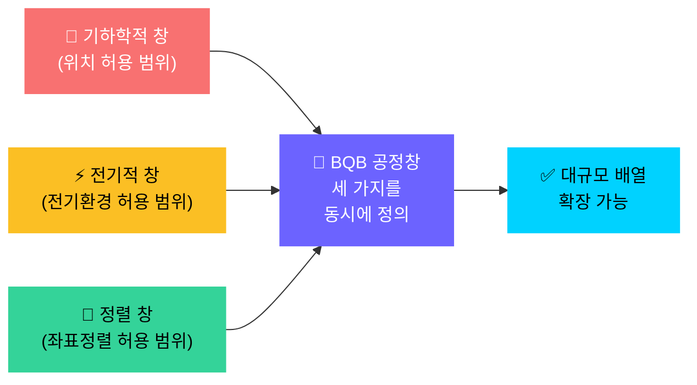
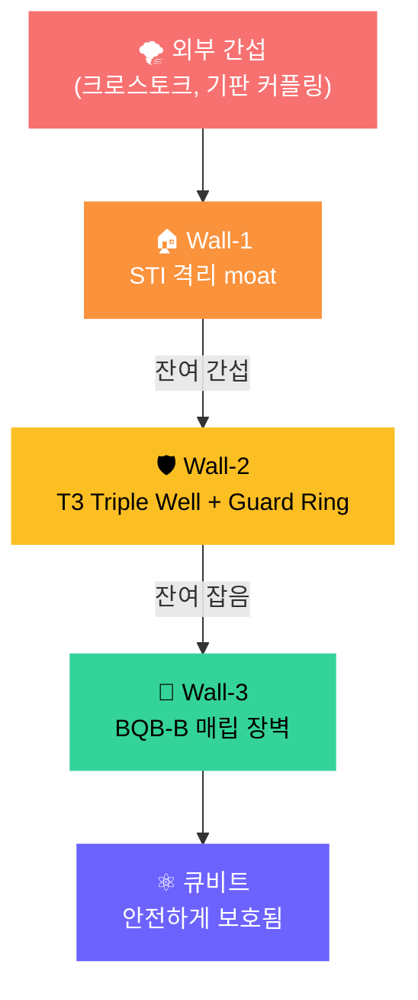
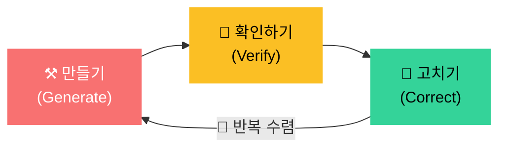
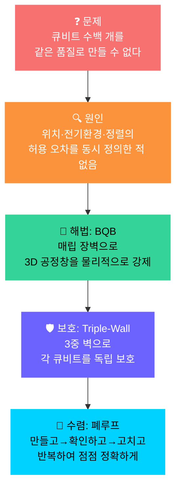

<div align="center">

<!-- Quantum Wave Header -->


<!-- Animated Typing -->


<!-- Quantum Badges -->
<br/>


<br/>

<!-- Animated atom gif -->


</div>

> **반도체 큐비트 대규모 배열의 핵심 기술을, 비유로 이해하기**
>
> 이 문서는 BQB의 개념과 원리를 양자컴퓨팅 배경지식이 없는 사람도 이해할 수 있도록 작성되었습니다.

<!-- Animated Divider -->


##  목차

<div align="center">

| 순서 | 주제 | 핵심 질문 |
|:---:|------|----------|
| 0 | [큐비트란?](#0--큐비트란) | 양자컴퓨터의 기본 단위가 뭔가요? |
| 1 | [왜 어려운가](#1--왜-어려운가) | 큐비트를 많이 만들면 왜 문제인가요? |
| 2 | [BQB 핵심 아이디어](#2--bqb-핵심-아이디어) | BQB는 이 문제를 어떻게 해결하나요? |
| 3 | [공정창(Process Window)](#3--공정창process-window) | "허용 오차 규격"이란 뭔가요? |
| 4 | [Triple-Wall 3중 보호벽](#4--triple-wall-3중-보호벽) | 큐비트를 어떻게 보호하나요? |
| 5 | [폐루프 공정](#5--폐루프-공정) | 만들고 → 확인하고 → 고치는 과정 |
| 6 | [전체 요약](#6--전체-요약) | 한눈에 정리 |

</div>

---

<!-- Section 0 Divider -->


## 0. ⚛️ 큐비트란?

<div align="center">

</div>

###  비트 vs 큐비트

일반 컴퓨터는 **비트(bit)** 를 씁니다. 비트는 `0` 또는 `1`, 둘 중 하나입니다.

양자컴퓨터는 **큐비트(qubit)** 를 씁니다. 큐비트는 `0`과 `1`을 **동시에** 가질 수 있습니다(중첩). 이 성질 덕분에 특정 문제를 훨씬 빨리 풀 수 있습니다.

<div align="center">

```
일반 비트:  🔘 0 또는 1       (한 가지 상태)
큐비트:    ⚛️ 0과 1 동시      (중첩 상태)
```

</div>

###  이 과제에서의 큐비트

이 과제에서 큐비트는 **실리콘(Si) 안에 심은 인(³¹P) 원자가 내놓는 전자 하나의 스핀(회전 방향)** 입니다.

<div align="center">

```
실리콘 결정 격자 안
    ↓
  ³¹P 원자 (인 원자 1개를 심음)
    ↓
  여분의 전자 1개가 생김
    ↓
  그 전자의 스핀 ↑ 또는 ↓ = 큐비트
```

</div>

> ⚠️ 참고: "인 원자의 스핀"이 아니라, 인 원자가 실리콘 격자에 들어가면서 내놓는 **전자의 스핀**이 큐비트입니다.

###  그런데, 큐비트 하나로는 쓸모가 없습니다

양자컴퓨터가 되려면 큐비트가 **수백~수천 개** 필요합니다. 그것도 격자처럼 **가지런히 배열**돼야 합니다.

<div align="center">

```
큐비트 1개:    ⚛️

큐비트 배열 (4×4 = 16개):

  ⚛️ ⚛️ ⚛️ ⚛️
  ⚛️ ⚛️ ⚛️ ⚛️
  ⚛️ ⚛️ ⚛️ ⚛️
  ⚛️ ⚛️ ⚛️ ⚛️

이 과제의 최종 목표: 16×16 = 256개 (기본) / 32×32 = 1,024개 (도전)
```

</div>

> [!IMPORTANT]
> **핵심:** 하나 만드는 건 됩니다. 문제는 **수백 개를 동시에, 같은 품질로** 만드는 겁니다.

---

<!-- Section 1 Divider -->


## 1. 💥 왜 어려운가

<div align="center">

</div>

###  "다트 던지기" 비유

실리콘 안에 인(P) 원자를 심는 걸 **"이온 주입"** 이라 합니다. 이걸 비유하면 **어두운 방에서 다트를 던지는 것**과 같습니다.

### 단계별로 보기

<details>
<summary><b>🎯 1단계: 다트 1개 던지기</b> (클릭하여 펼치기)</summary>
<br/>

```
        ┌─────────────┐
        │   ○         │
        │     ◉ ←hit! │  다트 1개는 과녁 근처에 꽂을 수 있음
        │             │
        └─────────────┘
```
→ 큐비트 1개는 만들 수 있다는 뜻입니다.

</details>

<details>
<summary><b>💥 2단계: 100개 던지기</b> (클릭하여 펼치기)</summary>
<br/>

```
        ┌─────────────┐
     ×  │ ×    ○      │
   ×    │   ×  ◉  ×   │  일부는 맞지만, 상당수는 흩어짐
        │ ×       ×   │
     ×  └─────────────┘  ×
            ×      ×
```
→ 이걸 **"산란(straggle)"** 이라 합니다 — 원자가 정확한 자리에 안 가고 흩어지는 현상.

</details>

<details>
<summary><b>🌪️ 3단계: 100개 + 환경 문제</b> (클릭하여 펼치기)</summary>
<br/>

```
   바람↗  전하잡음⚡  열🌡️
        ┌─~─~─~─~─~─┐
     ×  │≋×≋≋≋○≋≋≋≋≋│  과녁 자체가 흔들리고
   ×    │≋≋×≋≋◉≋×≋≋≋│  바람이 불고
        │≋×≋≋≋≋≋×≋≋≋│  옆 과녁과 부딪히면?
     ×  └─~─~─~─~─~─┘  ×
   크로스토크↔
```

→ 이것이 **대규모 배열이 실패하는 이유**입니다.

</details>

### 왜 실패하는가: 5가지 문제가 동시에 충돌

<div align="center">

| 문제 | 설명 | 비유 |
|------|------|------|
| 📍 공정 정밀도 | 이온 주입 시 산란으로 위치 오차 발생 | 다트가 흩어짐 |
| 🔀 위치 정렬 | 큐비트-배선-패키징 좌표계 불일치 누적 | 과녁이 벽에서 비뚤어짐 |
| ⚡ 전하 환경 | 계면 트랩/고정전하로 큐비트 특성 변동 | 바람이 불어서 궤적이 틀어짐 |
| 🌡️ 열 관리 | 배선 증가 → 열 유입 → 결맞음 시간 감소 | 과녁이 녹아내림 |
| 🔌 인터커넥션 | fan-out 급증 → 신호 무결성 저하 | 과녁에 전선이 엉켜 방해 |

</div>

> [!TIP]
> 기존 연구는 "다트를 더 잘 던지는 법"에 집중했습니다.
>
> BQB는 발상을 바꿉니다: **"과녁과 환경 자체를 고정하자."**

---

<!-- Section 2 Divider -->


## 2. 🧱 BQB 핵심 아이디어

<div align="center">

</div>

### BQB = 과녁판을 미리 만들어 두는 것

**BQB** = **B**uried **Q**uantum **B**arrier = **"매립된 양자 장벽"**

실리콘 웨이퍼 안에 **보이지 않는 울타리(장벽)를 미리 매립**해서, 원자가 심어질 수 있는 **3차원 공간을 물리적으로 제한**합니다.

### 기존 방식 vs BQB 방식

<div align="center">

```
┌──────────────────────────────┬──────────────────────────────┐
│        ❌ 기존 방식            │        ✅ BQB 방식            │
├──────────────────────────────┼──────────────────────────────┤
│                              │                              │
│     ↓↓↓ 이온 주입 ↓↓↓        │     ↓↓↓ 이온 주입 ↓↓↓        │
│  ┌──────────────────────┐    │  ┌──────────────────────┐    │
│  │ ×    ×               │    │  │ ┌────┐ ┌────┐ ┌────┐│    │
│  │    ×     ×    ×      │    │  │ │ ⚛️ │ │ ⚛️ │ │ ⚛️ ││    │
│  │  ×          ×        │    │  │ └────┘ └────┘ └────┘│    │
│  │       ×  ×     ×     │    │  │  BQB    BQB    BQB  │    │
│  └──────────────────────┘    │  └──────────────────────┘    │
│  실리콘 (아무 데나 퍼짐)       │  실리콘 (장벽 안에만 머뭄)     │
│                              │                              │
│  • 원자 위치 예측 불가         │  • 장벽이 허용 범위를 강제     │
│  • 주변 환경 제어 불가         │  • 전하 환경도 장벽이 차폐     │
│  • 배열 커질수록 수율 급락     │  • 규모 확장에도 수율 유지     │
└──────────────────────────────┴──────────────────────────────┘
```

</div>

> [!NOTE]
> **핵심:** BQB는 산란(흩어짐) 자체를 없애는 게 아닙니다.
> 흩어져도 **"허용 범위 안"에 머물도록** 물리적 울타리를 미리 만들어 두는 것입니다.

---

<!-- Section 3 Divider -->


## 3. 📐 공정창(Process Window)

<div align="center">

</div>

### 공정창 = 허용 오차의 규격서

BQB의 진짜 힘은 **"공정창(Process Window)"** 이라는 개념입니다.

<div align="center">

```
공정창이란:
"이 범위 안에만 들어오면 OK" 라는 허용 오차 규격을 미리 정의하는 것
```

</div>

BQB는 이 규격을 **세 가지 차원에서 동시에** 정의합니다:

### 세 가지 창

<details open>
<summary><b>📍 (A) 기하학적 창 (Geometric Window)</b></summary>
<br/>

| 항목 | 내용 |
|------|------|
| **한 마디로** | 큐비트 위치의 허용 범위 |
| **비유** | 🎯 과녁판의 크기 |
| **하는 일** | 원자가 심어질 수 있는 3D 공간의 크기를 정함. BQB 장벽이 이 공간의 '벽'이 되어, 산란된 원자가 벽 밖으로 나가면 그냥 무시됨 |
| **수치 목표** | 횡방향 σ_xy ≤ 20→10 nm, 종방향 σ_z ≤ 5 nm (연차별 강화) |

</details>

<details open>
<summary><b>⚡ (B) 전기적 창 (Electrostatic Window)</b></summary>
<br/>

| 항목 | 내용 |
|------|------|
| **한 마디로** | 전기 환경의 허용 범위 |
| **비유** | 🌬️ 과녁 주변 바람의 세기 |
| **하는 일** | 큐비트 주변의 전하 잡음, 전기장 기울기 등이 얼마나 흔들려도 괜찮은지의 범위를 정함. 범위를 벗어나면 큐비트 품질이 떨어짐 |
| **수치 목표** | 계면 트랩 D_it ≤ 10¹⁰ cm⁻²eV⁻¹, 전계 구배 \|∇E\| ~ 1-10 kV/cm |

</details>

<details open>
<summary><b>🎯 (C) 정렬 창 (Alignment Window)</b></summary>
<br/>

| 항목 | 내용 |
|------|------|
| **한 마디로** | 좌표 정렬의 허용 범위 |
| **비유** | 📐 과녁판이 벽에 얼마나 정확히 붙어있는지 |
| **하는 일** | 큐비트 위치와 그 위에 올라가는 배선/패키징의 좌표가 얼마나 어긋나도 되는지를 정함 |
| **수치 목표** | overlay ≤ 15~30 nm |

</details>

### 세 가지 창의 관계



> [!WARNING]
> **핵심:** 이 세 가지 범위가 **동시에** 정의돼야 합니다.
> 하나라도 빠지면, 배열이 커질수록 오차가 누적되어 수율이 급격히 떨어집니다.

---

<!-- Section 4 Divider -->


## 4. 🛡️ Triple-Wall 3중 보호벽

<div align="center">

</div>

BQB는 각 큐비트를 **세 겹의 벽**으로 둘러쌉니다. 각 벽은 서로 다른 종류의 위협을 막습니다.

### 구조 단면도

<div align="center">

```
┌─────────────────────────────────────────────┐
│  Wall-1: 외곽 격리벽 (STI)                     │ ← 🏠 집의 외벽
│  ┌─────────────────────────────────────┐     │
│  │  Wall-2: 전기 차폐벽 (T3 Triple Well)  │     │ ← 🛡️ 방의 차음벽
│  │  ┌─────────────────────────────┐     │     │
│  │  │  Wall-3: 매립 장벽 (BQB-B)    │     │     │ ← 🎯 과녁의 테두리
│  │  │  ┌───────────────────┐     │     │     │
│  │  │  │                   │     │     │     │
│  │  │  │     ⚛️ 큐비트      │     │     │     │
│  │  │  │     (³¹P 전자)     │     │     │     │
│  │  │  │                   │     │     │     │
│  │  │  └───────────────────┘     │     │     │
│  │  └─────────────────────────────┘     │     │
│  └─────────────────────────────────────┘     │
└─────────────────────────────────────────────┘
```

</div>

### 각 벽의 역할

<div align="center">

| 벽 | 이름 | 비유 | 차단 대상 | 구현 방법 |
|:---:|------|:---:|----------|----------|
| **Wall-1** | 외곽 격리벽 | 🏠 집의 외벽 | 옆 큐비트의 간섭(크로스토크) | STI(얕은 트렌치)로 도랑을 파서 옆 칸과 물리적으로 분리 |
| **Wall-2** | 전기 차폐벽 | 🛡️ 방의 차음벽 | 전기 잡음, 전하 흔들림 | T3(Triple Well) 구조로 전기적 실드를 형성. 각 큐비트를 독립적으로 미세 조정 가능 |
| **Wall-3** | 매립 장벽 (BQB-B) | 🎯 과녁의 테두리 | 원자의 산란, 채널링 | 실리콘 내부에 매립된 장벽. 원자가 너무 깊이 가거나 옆으로 퍼지는 것을 물리적으로 차단 |

</div>

### Triple-Wall 방어 흐름



<div align="center">

```
바깥 세상의 간섭 → 🏠 Wall-1이 차단 (물리적 격리)
                      ↓ (통과한 것만)
전기적 잡음      → 🛡️ Wall-2가 차단 (전기적 차폐)
                      ↓ (통과한 것만)
원자의 산란      → 🎯 Wall-3이 차단 (위치 제한)
                      ↓
                   ⚛️ 큐비트: 안전!
```

</div>

---

<!-- Section 5 Divider -->


## 5. 🔄 폐루프 공정

<div align="center">

</div>

### 핵심 원칙

> 한 번에 완벽하게 만들 필요 없습니다.
>
> **"빠르게 반복해서 점점 정확하게"** 수렴시키는 게 핵심입니다.

### 3단계 순환



### 각 단계 상세

<div align="center">

| 단계 | 이름 | 비유 | 하는 일 |
|:---:|------|------|----------|
| ⚒️ | **생성 (Generate)** | 과녁판에 다트를 던짐 | BQB 템플릿이 정해 놓은 자리에 이온을 주입하여 큐비트를 만듦 |
| 🔬 | **검증 (Verify)** | 다트가 어디 꽂혔는지 카메라로 촬영 | 3D 촬영(nano-CT 등)으로 원자가 정확한 위치에 갔는지, 전기 환경은 괜찮은지 확인 |
| 🔧 | **보정 (Correct)** | 조준점을 조정해서 다시 던짐 | 어긋난 부분이 있으면 다음 번에 더 정확하도록 주입 조건(에너지, 각도, 선량 등)을 수정 |

</div>

### 반복할수록 일어나는 일

<div align="center">

```
1회전:  ×  ×  ⚛️  ×  ×      → 5개 중 1개 성공   ░░░░░░░░░░░░░░░ 20%
2회전:  ×  ⚛️  ⚛️  ⚛️  ×    → 5개 중 3개 성공   █████████░░░░░░ 60%
3회전:  ⚛️  ⚛️  ⚛️  ⚛️  ×   → 5개 중 4개 성공   ████████████░░░ 80%
 ...
N회전:  ⚛️  ⚛️  ⚛️  ⚛️  ⚛️  → 공정창 안으로 수렴! ███████████████ 99%+
```

</div>

### 폐루프의 산출물

> 이 반복으로 만들어지는 것들:

| # | 산출물 | 설명 |
|:---:|------|------|
| 1 | **공정창 항목별 허용치** | 위치/전기/정렬 각각의 OK 범위 |
| 2 | **outlier 확률 및 원인 모델** | 실패한 큐비트가 왜 실패했는지 |
| 3 | **die-map 기반 재매핑 규칙** | 실패한 자리를 우회하는 방법 |
| 4 | **공정-운용 통합 보정 테이블** | 다음에 더 잘 만들기 위한 레시피 |

---

<!-- Section 6 Divider -->


## 6. 📋 전체 요약

<div align="center">

</div>

### 전체 흐름



<div align="center">

```
 ❓ 문제     큐비트 수백 개를 같은 품질로 동시에 만들 수 없다
    │
    ▼
 🔍 원인     위치·전기환경·정렬의 허용 오차를 동시에 정의한 적이 없다
    │
    ▼
 🎯 해법     BQB — 매립 장벽으로 3D 허용 범위(공정창)를 물리적으로 강제
    │
    ▼
 🛡️ 보호     Triple-Wall — 3중 벽(격리/차폐/매립)으로 각 큐비트를 독립적으로 보호
    │
    ▼
 🔄 수렴     폐루프 — 만들고 → 확인하고 → 고치고를 반복하여 점점 정확하게
```

</div>

### 한 문장 결론

<div align="center">

> **BQB는 "더 좋은 큐비트"를 만드는 기술이 아닙니다.**
>
> **"수백 개를 동시에 만들 수 있는 규격과 구조"를 정의하는 프레임워크입니다.**

</div>

---


## 📚 용어 사전

<details>
<summary><b>📖 클릭하여 펼치기</b></summary>
<br/>

| 용어 | 뜻 | 비유 |
|------|-----|------|
| **큐비트(Qubit)** | 양자컴퓨터의 기본 단위. 0과 1을 동시에 가질 수 있음 | 양면 동전이 공중에 떠 있는 상태 |
| **이온 주입** | 원자를 가속해서 실리콘 안에 심는 과정 | 다트 던지기 |
| **산란(Straggle)** | 이온 주입 시 원자가 의도한 위치에서 흩어지는 현상 | 다트가 과녁에서 빗나감 |
| **채널링(Channeling)** | 원자가 결정 격자 틈을 타고 너무 깊이 들어가는 현상 | 다트가 구멍으로 빠짐 |
| **BQB** | Buried Quantum Barrier. 매립된 양자 장벽 | 과녁판의 테두리 |
| **공정창(Process Window)** | 허용 오차의 규격서. 세 가지(위치/전기/정렬)를 동시 정의 | "여기까지만 OK" |
| **Triple-Wall** | 3중 보호벽 (STI격리 + T3차폐 + BQB-B매립장벽) | 외벽 + 차음벽 + 과녁 테두리 |
| **폐루프(Closed-loop)** | 생성→검증→보정을 반복하는 공정 | 다트 던지고 → 확인하고 → 조준 수정 |
| **STI** | Shallow Trench Isolation. 얕은 도랑으로 격리 | 집과 집 사이의 담장 |
| **T3** | True Triple Well. 3중 우물 구조로 전기적 차폐 | 방음벽 |
| **FD-SOI** | 22nm 반도체 공정. 이 과제의 기반 플랫폼 | 건물의 기초 공사 |
| **DD-IC** | Dynamic Decoupling IC. 77K에서 큐비트 제어 펄스를 생성하는 칩 | 큐비트 배열의 "지휘자" |

</details>

---


## 🏗️ 프로젝트 정보

<div align="center">

| 항목 | 내용 |
|------|------|
| **과제명** | 단일 반도체 큐비트의 대규모 배열 제작 및 집적 위한 핵심 공정 기술 개발 |
| **RFP** | 2026-양자-5 (품목공모형) |
| **주관기관** | 국민대학교 |
| **공동연구** | 국립한국해양대학교, 나고야대학교 |
| **기간** | 5년 (2026.04 ~ 2030.12) |
| **목표 TRL** | 3 → 5 |
| **배열 목표** | 16×16 (기본) / 32×32 (도전) |

<!-- Tech Stack Badges -->
<br/>


</div>

---

<!-- Footer -->
<div align="center">


<br/>


<br/>

*이 문서는 BQB 기술의 개념 이해를 돕기 위해 작성되었습니다.*
*정확한 기술 사양은 제안서 원문을 참조하시기 바랍니다.*

<br/>


</div>
