<div align="center">

<!-- ═══════════════════ HEADER ═══════════════════ -->


<!-- Animated Topic Lines -->


<br/>

<!-- Badges -->


<br/>


</div>

---

## 이 가이드를 읽기 전에

**초급 가이드**에서 다음을 이해했다고 가정합니다:

- 큐비트는 실리콘 안에 심은 ³¹P 원자 하나의 스핀이다
- 하나를 만드는 건 되지만, 수백 개를 **동시에 같은 품질로** 만드는 것이 문제다
- BQB는 실리콘 안에 미리 **보이지 않는 울타리(장벽)** 를 매립해서, 원자가 심어질 3D 공간을 물리적으로 제한하는 구조다
- 공정창은 "이 범위 안에만 들어오면 OK"라는 허용 오차 규격이다

**이 가이드는 "왜"에 집중합니다.** 왜 그 숫자인지, 왜 그 구조인지, 왜 다른 방법은 안 되는지를 물리에서 도출합니다.


## 📑 목차 — 하나의 질문에서 시작합니다

> **"사이트 수율 95%면 충분히 좋은 거 아닌가요?"**

이 질문에 대답하는 과정이 이 가이드 전체입니다.

<div align="center">

| # | 주제 | 핵심 질문 | 키워드 |
|:---:|------|----------|-------|
| 1 | [📊 확장의 수학](#1--확장의-수학--왜-95로는-부족한가) | 사이트 수율 95%면 배열은 몇 % 동작하는가? | `p^N²`, 거듭제곱 |
| 2 | [⚛️ 이온 주입의 물리](#2-️-이온-주입의-물리--산란은-확률이다) | 왜 같은 조건으로 쏘는데 다른 곳에 박히는가? | `σ_xy`, `σ_z`, channeling |
| 3 | [🎯 공정창이라는 발상](#3--공정창이라는-발상--산란을-허용하되-가두기) | 산란을 없앨 수 없다면, 어떻게 관리하는가? | 3축 동시 정의 |
| 4 | [🧱 BQB — 기하학적 강제](#4--bqb--기하학적-강제) | 장벽이 공정창을 물리적으로 어떻게 만드는가? | 개구 + 매립 장벽 |
| 5 | [🛡️ Triple-Wall — 세 겹의 방어](#5-️-triple-wall--세-겹의-방어) | 위치 말고 전기·정렬 문제는 어떻게 잡는가? | STI / T3 / BQB-B |
| 6 | [🔄 폐루프 — 수렴시키기](#6--폐루프--한-번에-맞추지-않고-수렴시키기) | 왜 "한 번에 맞추는 공정"을 포기했는가? | G→V→C 반복 |
| 7 | [🏗️ 전체 아키텍처](#7-️-전체-아키텍처--왜-이-구조여야-하는가) | 칩 제작, 큐비트 생성, 제어를 왜 분리하는가? | DD-IC, Split-Stage |

</div>


## 1. 📊 확장의 수학 — 왜 95%로는 부족한가

### 1.1 한 가지 계산만 기억하세요

배열이 동작하려면 **모든 사이트가 동시에** 정상이어야 합니다. 부분 동작은 없습니다.

따라서 배열 수율은 사이트 수율의 **거듭제곱**입니다:

```
배열 수율  =  (사이트 수율)^(사이트 수)

예:  16×16 배열  =  256개 사이트
     사이트 수율 p = 0.95일 때
     배열 수율 = 0.95^256 ≈ 0.000002  →  0.0002%
```

이것은 근사가 아니라 정확한 계산입니다. 독립 사건의 동시 성공 확률이기 때문입니다.

### 1.2 숫자를 직접 느껴보세요

아래 표를 **세로가 아니라 가로로** 읽어보세요. 배열이 커질수록 무슨 일이 일어나는지 보입니다.

<div align="center">

| 사이트 수율 (p) | 4×4 (16개) | 8×8 (64개) | 16×16 (256개) | 32×32 (1024개) |
|:-:|:-:|:-:|:-:|:-:|
| **90%** | 18.5% | 0.12% | ≈ 0% | ≈ 0% |
| **95%** | 44.0% | 3.7% | 🔴 ≈ 0% | ≈ 0% |
| **99%** | 85.1% | 52.5% | 🟡 7.6% | 0.003% |
| **99.5%** | 92.3% | 72.6% | 🟢 27.8% | 0.6% |
| **99.9%** | 98.4% | 93.8% | 🟢 77.4% | 🟢 35.8% |

</div>

16×16 배열에서 유의미한 수율(>10%)을 얻으려면 사이트 수율이 **99% 이상**이어야 합니다. 32×32에서는 **99.9%** 가 필요합니다.

### 1.3 이것이 문제의 본질을 바꿉니다

단일 큐비트 연구에서는 100개를 만들고 가장 좋은 것을 **골라** 쓸 수 있습니다(후선별). 그러나 배열에서는:

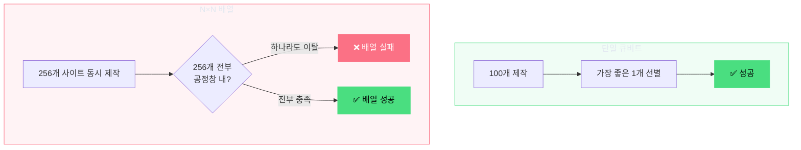

> [!IMPORTANT]
> **이 사실이 BQB 전체 설계를 결정합니다.**
> "더 좋은 큐비트를 만드는 것"이 아니라, **"공정 산포를 극한까지 줄이는 것"** 이 확장의 본질입니다.

<details>
<summary><b>🧪 자기 점검 (클릭하여 열기)</b></summary>
<br/>

**Q:** 사이트 수율 98%로 16×16 배열을 만들면 배열 수율이 약 몇 %일까요?

**A:** 0.98^256 ≈ **0.6%**. 거의 동작하지 않습니다. 98%는 "아주 높은 수율"처럼 느껴지지만, 256개의 동시 성공 앞에서는 무력합니다.

</details>


## 2. ⚛️ 이온 주입의 물리 — 산란은 확률이다

1장에서 사이트 수율 99% 이상이 필요하다는 것을 확인했습니다.
그러면 다음 질문은: **왜 사이트 수율을 99%로 만들기가 어려운가?**

답은 이온 주입의 물리에 있습니다.

### 2.1 이온이 실리콘에 들어가면 일어나는 일

가속된 ³¹P⁺ 이온(keV 에너지)이 Si 격자에 진입하면, 두 가지 감속 메커니즘을 동시에 겪습니다:

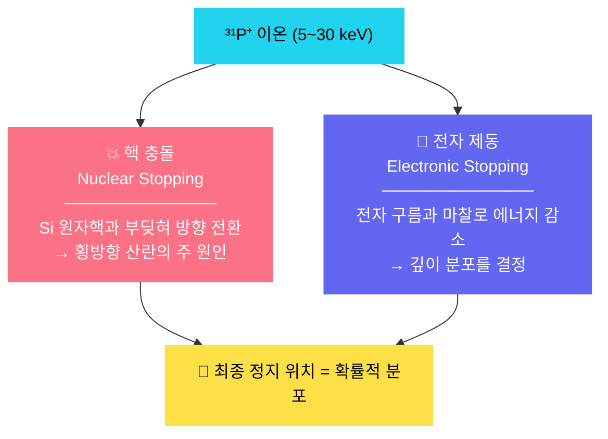

핵심은 핵 충돌이 **무작위**라는 점입니다. 이온이 Si 원자핵을 만나는 각도, 거리, 횟수가 매번 다릅니다. 그래서 동일한 에너지·동일한 각도로 주입해도 **최종 정지 위치가 매번 다릅니다**.

### 2.2 산란의 세 가지 얼굴

이 무작위성이 만드는 세 가지 현상이 있습니다:

<details open>
<summary><b>① 횡방향 산란 (lateral straggle, σ_xy)</b></summary>
<br/>

이온이 빔 축에서 좌우로 얼마나 벗어나는지입니다. 핵 충돌에 의한 무작위 방향 전환이 원인이며, keV급 에너지에서 **수~수십 nm** 범위의 가우시안 분포를 따릅니다.

```
              빔 축 (목표 위치)
                 │
                 │   ← σ_xy →
        ─────────┼─────────
                 │
           ···•····•··•·····    ← 이온들의 실제 정지 위치
             •·•···•·····•·        (빔 축 주변에 퍼져 있음)
```

</details>

<details open>
<summary><b>② 종방향 산란 (longitudinal straggle, σ_z)</b></summary>
<br/>

이온이 목표 깊이에서 위아래로 얼마나 벗어나는지입니다. 에너지 손실률의 통계적 변동이 원인이며, 평균 정지 깊이(R\_p) 주변에 가우시안 분포를 형성합니다.

```
        표면 ─────────────────────
               
               
        R_p ─ ─ ─ ─•─•─•─ ─ ─ ─   ← 대부분의 이온은 여기 근처
               │   σ_z   │
               •         •          ← 일부는 위아래로 벗어남
```

</details>

<details open>
<summary><b>③ 채널링 (channeling) — 🔴 가장 위험</b></summary>
<br/>

Si는 결정체이고, 원자들이 규칙적으로 배열되어 있습니다. 이온이 우연히 결정 축과 정렬되면, 원자들 **사이의 빈 통로(채널)** 를 따라 거의 충돌 없이 깊이 관통합니다.

```
        정상 주입:  이온 → •💥•💥•💥• → 정지 (R_p 근처)

        채널링:     이온 → · · · · · · · · · · → 훨씬 깊이 관통
                           (원자 사이 채널을 통과)
```

채널링의 문제는 **비가우시안**이라는 점입니다. R\_p 너머로 수백 nm까지 **지수적으로 감쇠하는 긴 tail**이 생깁니다. 가우시안 산란은 예측 가능하지만, 채널링 tail은 이온이 **예측 불가한 깊이까지 도달**하게 만듭니다.

</details>

### 2.3 세 가지 산란 유형 비교

<div align="center">

| 유형 | 물리적 원인 | 분포 형태 | 범위 | 위험도 |
|:---:|-----------|:-------:|------|:----:|
| **σ\_xy** (횡방향) | 핵 충돌의 무작위 방향 전환 | 가우시안 | 수~수십 nm | 🟡 |
| **σ\_z** (종방향) | 에너지 손실률의 통계적 변동 | 가우시안 | 수~수십 nm | 🟡 |
| **채널링 tail** | 결정 축 정렬 → 격자 채널 관통 | **비가우시안** (지수 감쇠) | **수백 nm** | 🔴 |

</div>

### 2.4 왜 이것이 배열에서 치명적인가

단일 큐비트에서는 산란이 큰 문제가 아닙니다. 주입 후 측정해서, 위치가 좋으면 쓰고 나쁘면 버립니다.

그러나 배열에서는 **256개 사이트 전부가** 동시에 허용 범위 안에 들어와야 합니다:

```
σ_xy = 30nm, 허용 범위 = ±20nm인 경우:
  → 한 사이트 OK 확률  ≈ 50%
  → 256개 전부 OK      = 0.50^256 ≈ 0%          ← 완전 불가능

σ_xy = 10nm, 허용 범위 = ±20nm인 경우:
  → 한 사이트 OK 확률  ≈ 95%
  → 256개 전부 OK      = 0.95^256 ≈ 0.0002%     ← 여전히 불가능

∴ 산란을 줄이는 것만으로는 부족합니다.
```

> [!WARNING]
> **산란은 물리 법칙이므로 제거할 수 없습니다.** 이것이 3장에서 전혀 다른 접근이 필요한 이유입니다.

<details>
<summary><b>🧪 자기 점검 (클릭하여 열기)</b></summary>
<br/>

**Q:** 채널링이 왜 가우시안 산란보다 더 위험한지 한 문장으로 설명할 수 있나요?

**A:** 가우시안 산란은 범위가 예측 가능하지만(±3σ 안에 99.7%), 채널링 tail은 **비가우시안 — 예측 불가한 깊이까지** 이온을 보내기 때문입니다.

</details>


## 3. 🎯 공정창이라는 발상 — 산란을 허용하되 가두기

### 3.1 발상의 전환

2장의 결론은 명확합니다: **산란을 줄이는 것만으로는 배열 수율을 확보할 수 없다.**

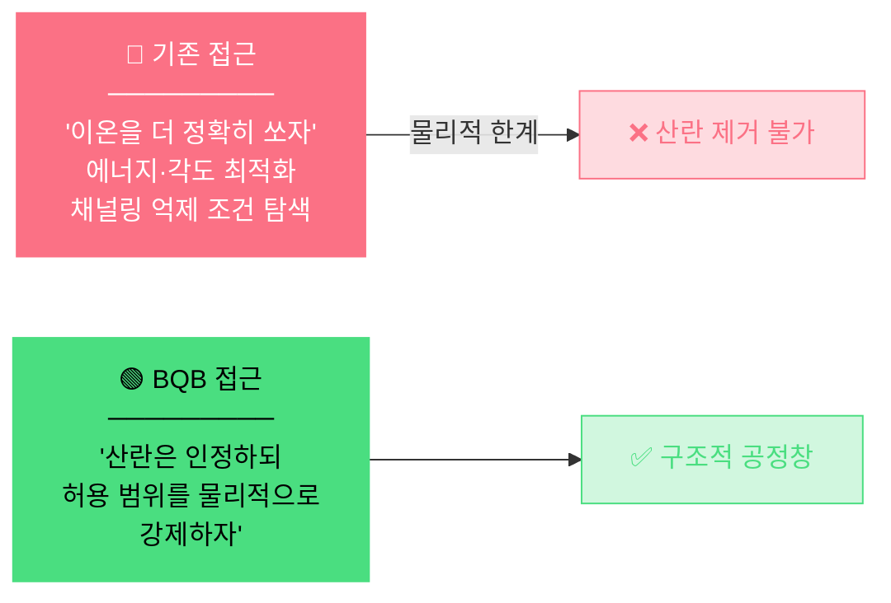

이것이 **공정창(Process Window)** 이라는 개념입니다.

### 3.2 공정창은 무엇인가

공정창은 "이 범위 안에만 들어오면 큐비트가 정상 동작한다"는 **다차원 허용 오차 공간의 정량적 정의**입니다.

중요한 것은, 이 공정창이 **세 가지 독립 축**으로 구성된다는 점입니다. 하나만 만족해서는 안 되고, 세 가지가 **동시에** 충족되어야 합니다:

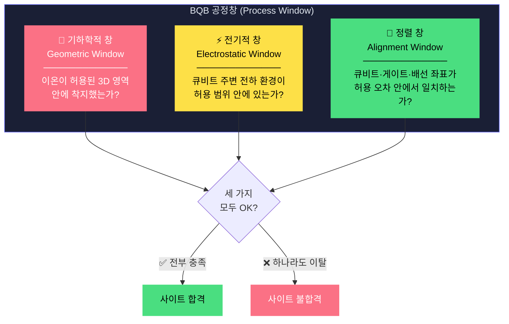

### 3.3 왜 세 가지가 필요한가 — 사고 실험

<details open>
<summary><b>🧪 기하학적 창만 있으면?</b></summary>

이온이 정확한 위치에 착지했더라도, 주변 전하 환경이 불안정하면 큐비트 주파수가 흔들리고 결맞음(coherence)이 깨집니다. **위치가 맞아도 동작하지 않는 사이트**가 됩니다.
</details>

<details open>
<summary><b>🧪 전기적 창만 있으면?</b></summary>

전하 환경이 깨끗해도, 이온이 엉뚱한 곳에 박혔으면 게이트 전극이 닿지 않습니다. **제어 불가능한 사이트**가 됩니다.
</details>

<details open>
<summary><b>🧪 기하 + 전기가 모두 좋은데 정렬이 틀리면?</b></summary>

큐비트 좌표계와 배선/패키징 좌표계가 어긋나면, 제어 신호가 엉뚱한 곳으로 갑니다. 배열이 커질수록 좌표계 간 **누적 오차**가 증가하므로, 정렬 오차 예산을 미리 정의해야 합니다.
</details>

### 3.4 각 창의 정량 규격

아래 수치들은 "있으면 좋겠다"가 아니라, 1장의 배열 수율 계산에서 역산된 **필수 조건**입니다.

<details open>
<summary><b>📍 ① 기하학적 창 (Geometric Window)</b></summary>
<br/>

큐비트가 형성될 수 있는 유효 3D 영역의 크기를 정의합니다.

| 파라미터 | 무엇을 의미하는가 | 연차별 목표 |
|---------|----------------|----------|
| **σ\_xy** (횡방향 위치 분산) | 이온이 빔 축에서 좌우로 얼마나 벗어나는가 | ≤20nm → ≤10nm → ≤5nm(최종) |
| **σ\_z** (종방향 위치 분산) | 이온이 목표 깊이에서 위아래로 얼마나 벗어나는가 | ≤20nm → ≤10nm → ≤5nm(최종) |
| **개구 CD** | BQB 템플릿에서 이온이 통과할 수 있는 구멍의 폭 | 40~120nm |
| **장벽 깊이** | BQB-B 매립 장벽의 깊이 (채널링 차단선) | 80~300nm |

**물리적 강제**: BQB 개구가 횡방향 구속, BQB-B 장벽이 종방향 절단

</details>

<details open>
<summary><b>⚡ ② 전기적 창 (Electrostatic Window)</b></summary>
<br/>

큐비트 주변 전하 환경의 허용 변동 범위를 정의합니다.

| 파라미터 | 무엇을 의미하는가 | 목표 |
|---------|----------------|------|
| **D\_it** (계면 트랩 밀도) | 게이트-Si 계면 결함 → 큐비트 주파수 무작위 변동 | ≤10¹⁰ cm⁻²eV⁻¹ |
| **Q\_f** (고정 전하 밀도) | 산화막 내 갇힌 전하 → 전계 환경 왜곡 | ≤5×10¹⁰ cm⁻² |
| **\|∇E\|** (국부 전계 기울기) | 큐비트 근방 전기장 불균일 → valley splitting 변동 | 최소화 (공정창 항목) |
| **S\_Q(1Hz)** (1/f 전하 잡음) | 저주파 전하 요동 → 결맞음 시간 직접 감소 | ≈10⁻³ e/√Hz |

**물리적 강제**: BQB 패시베이션 + Triple-Wall T3 guard ring

</details>

<details open>
<summary><b>🎯 ③ 정렬 창 (Alignment Window)</b></summary>
<br/>

큐비트 좌표계와 외부 배선/패키징 좌표계 간 허용 오차를 정의합니다.

| 파라미터 | 무엇을 의미하는가 | 목표 |
|---------|----------------|------|
| **Q-게이트 overlay** | 큐비트 ↔ 제어 게이트 정렬 오차 | ≤15nm |
| **Q-패키징 overlay** | 큐비트 ↔ DD-IC 패키지 정렬 오차 | ≤30nm |
| **검증 지표** | ΔR/R, 누설전류, 열 사이클 | 실측 기반 |

**물리적 강제**: STI moat 경계 기준 + 얼라인 마크 체계

</details>

> [!IMPORTANT]
> **"공정창을 정의한다"는 것은 수치를 정하는 것뿐만 아니라, 그 수치를 물리적 구조로 강제한다는 의미입니다.** 다음 장에서 이것이 어떻게 실현되는지 봅니다.


## 4. 🧱 BQB — 기하학적 강제

### 4.1 핵심 메커니즘: 장벽이 공정창을 만든다

BQB(Buried Quantum Barrier)의 핵심은 간단합니다: **실리콘 내부에 물리적 장벽을 미리 매립하여, 이온이 착지할 수 있는 3D 공간의 경계를 구조적으로 설정한다.**

이것은 "이온을 정확히 쏘는" 접근과 근본적으로 다릅니다. 이온이 아무리 흩어져도, 장벽이 정의한 유효 영역 안에 착지한 이온만 기능적으로 유효하고, 유효 영역 밖으로 빠진 이온은 기능에 영향을 주지 않습니다.

### 4.2 BQB-B의 두 가지 역할

```
           이온 빔 ↓↓↓
        ┌──────────────────┐  표면
        │                  │
        │    ┌────────┐    │  ← 개구 (CD: 40~120nm)
        │    │        │    │     횡방향 산란을 구속
        │    │  유효   │    │
        │    │  포획   │    │     이 영역 안 → ✅ 활성
        │    │  체적   │    │     이 영역 밖 → ❌ 비활성
        │    │        │    │
        │    └────────┘    │
        │ ▓▓▓▓▓▓▓▓▓▓▓▓▓▓▓ │  ← BQB-B 매립 장벽 (깊이: 80~300nm)
        │ ▓▓▓▓▓▓▓▓▓▓▓▓▓▓▓ │     채널링 tail을 절단
        │                  │
        └──────────────────┘  Si 기판
```

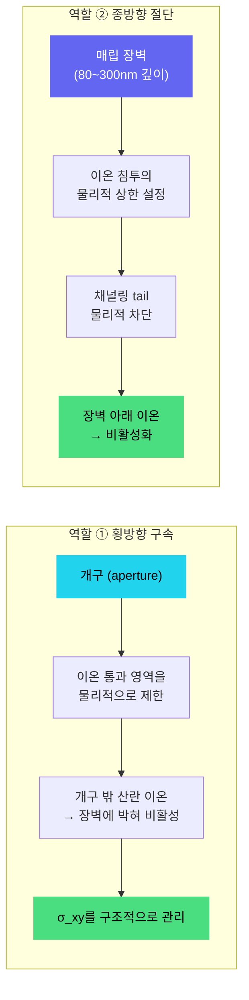

### 4.3 왜 이것이 산란을 "없애는 것"보다 나은가


정량적으로: 개구 CD = 80nm, 장벽 깊이 = 200nm인 BQB를 설치하면, 주입 조건과 무관하게 **유효 포획 체적**이 80nm × 80nm × 200nm로 결정됩니다. 산란이 아무리 심해도 이 체적 밖의 이온은 무시됩니다.

<details>
<summary><b>🧪 자기 점검 (클릭하여 열기)</b></summary>
<br/>

**Q:** BQB가 산란을 "줄이는" 것인지, "가두는" 것인지 구분할 수 있나요?

**A:** **"가두는" 것입니다.** 산란 자체는 여전히 발생하지만, 장벽 밖의 산란은 기능에 영향을 주지 않습니다. 산란을 줄이는 게 아니라, 산란이 영향을 미칠 수 있는 공간을 물리적으로 제한합니다.

</details>


## 5. 🛡️ Triple-Wall — 세 겹의 방어

### 5.1 왜 BQB-B만으로는 부족한가

4장의 BQB-B는 **기하학적 공정창**을 해결합니다. 그러나 3장에서 확인했듯이, 공정창에는 세 가지 축이 있습니다:


이 나머지 문제를 해결하는 것이 **Triple-Wall** 구조입니다.

### 5.2 세 겹의 벽, 세 가지 메커니즘

Triple-Wall은 **서로 다른 물리적 메커니즘**으로 동작하는 세 겹의 격리층입니다:

```
        Surface
   ╔═══════════════════════════════════════════════╗
   ║  ┌────────────────────────────────────────┐   ║
   ║  │  🔴 Wall-1: STI 격리 moat               │   ║
   ║  │  SiO₂ 충전 트렌치                        │   ║
   ║  │  → 기판 커플링 차단 + 표면 누설 절단       │   ║
   ║  │                                          │   ║
   ║  │  ┌──────────────────────────────────┐   │   ║
   ║  │  │  🟡 Wall-2: T3 Triple Well        │   │   ║
   ║  │  │  + Quiet Guard Ring               │   │   ║
   ║  │  │  deep n-well / p-well / n-well    │   │   ║
   ║  │  │  → ∇E 침투 감쇠 + 1/f 잡음 차폐    │   │   ║
   ║  │  │  → DD-IC 스위칭 노이즈 격리         │   │   ║
   ║  │  │                                    │   │   ║
   ║  │  │  ┌────────────────────────────┐   │   │   ║
   ║  │  │  │  🟢 Wall-3: BQB-B 매립 장벽  │   │   │   ║
   ║  │  │  │  → 횡방향 산란 구속 (개구)    │   │   │   ║
   ║  │  │  │  → 채널링 tail 절단 (장벽)    │   │   │   ║
   ║  │  │  │  → 도너 열확산 차단           │   │   │   ║
   ║  │  │  │                              │   │   │   ║
   ║  │  │  │        ⚛️ Qubit (³¹P)        │   │   │   ║
   ║  │  │  │                              │   │   │   ║
   ║  │  │  └────────────────────────────┘   │   │   ║
   ║  │  └──────────────────────────────────┘   │   ║
   ║  └────────────────────────────────────────┘   ║
   ╚═══════════════════════════════════════════════╝
        Si Substrate
```

### 5.3 각 벽의 물리적 메커니즘

<details open>
<summary><b>🔴 Wall-1: STI (Shallow Trench Isolation) 격리 moat — "물리적 해자"</b></summary>
<br/>

| 항목 | 상세 |
|:---:|------|
| **구현** | 타일 경계에 SiO₂ 충전 트렌치를 형성 |
| **차단 대상** | 인접 큐비트 간 **기판 커플링** + **표면 누설 전류** |
| **메커니즘** | SiO₂의 높은 절연 장벽이 전자/정공 이동 경로를 물리적으로 절단 |
| **설계 변수** | moat 폭/간격, 타일 pitch, 금속/비아 keep-out |
| **한계** | 기판 내부의 깊은 경로(deep substrate path)는 차단 불가 → **Wall-2가 보완** |

</details>

<details open>
<summary><b>🟡 Wall-2: T3 (True Triple Well) + Quiet Guard Ring — "전기적 실드"</b></summary>
<br/>

| 항목 | 상세 |
|:---:|------|
| **구현** | deep n-well / p-well / n-well 3중 우물 + 외곽 quiet guard ring |
| **차단 대상** | **전계 구배 침투(\|∇E\|)**, **1/f 전하 잡음**, **DD-IC 스위칭 노이즈** |
| **메커니즘** | 트리플웰 구조로 back-gate와 기판의 전기적 결합을 약화시켜 웰 도메인을 분리. guard ring이 잔여 전계를 추가 감쇠 |
| **정량 지표** | \|∇E\| 및 1/f 전하잡음 민감도 저감, S\_Q(1Hz) 목표 충족 |
| **핵심 효과** | 각 큐비트의 **back-gate와 웰 도메인을 전기적으로 독립 분리** → 타일 단위 개별 미세 조정 가능 |

</details>

<details open>
<summary><b>🟢 Wall-3: BQB-B 매립 장벽 — "기하학적 가둠" (4장 복습)</b></summary>
<br/>

| 항목 | 상세 |
|:---:|------|
| **구현** | BQB 매립 장벽/템플릿 층 + 폴리실리콘/CVD 스페이서 기반 자기정렬 개구부 (장벽 깊이 80~300nm, 개구 CD 40~120nm) |
| **차단 대상** | **이온 산란(straggle)**, **채널링 tail**, **도너 열확산** |
| **메커니즘** | 개구가 횡방향 구속 + 장벽 깊이가 종방향 절단 |
| **정량 지표** | σ\_xy/σ\_z 공정창 강제, 장벽 깊이 80~300nm, 개구 CD 40~120nm |
| **핵심 효과** | **기하학적 공정창을 물리적으로 강제** — 주입 조건과 무관하게 유효 포획 체적이 구조에 의해 결정 |

</details>

### 5.4 직렬 감쇠 구조

세 벽이 직렬로 배치되어 있으므로, 간섭 신호는 **세 겹의 감쇠**를 거칩니다:

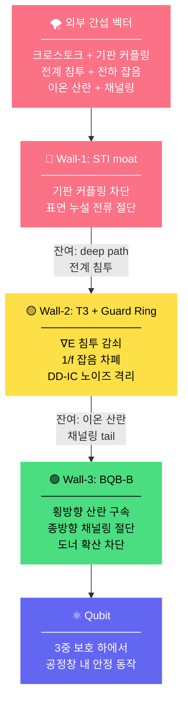

### 5.5 공정창 축 ↔ 벽 매핑

<div align="center">

| 공정창 축 | 해결하는 벽 | 물리적 메커니즘 |
|:--------:|:---------:|:-------------:|
| ① 기하학적 (위치) | 🟢 Wall-3 (BQB-B) | 개구 구속 + 장벽 절단 |
| ② 전기적 (전하 환경) | 🟡 Wall-2 (T3+Guard) | pn-junction 실드 + guard ring |
| ③ 정렬 (좌표계 일치) | 🔴 Wall-1 (STI) + 전체 구조 | 경계 기준 확보 + 얼라인 마크 |

</div>

<details>
<summary><b>🧪 자기 점검 (클릭하여 열기)</b></summary>
<br/>

**Q:** Wall-2(T3)가 없다면 어떤 문제가 생기나요?

**A:** DD-IC 스위칭 노이즈가 큐비트에 직접 전달되고, 인접 타일의 전계 변동이 큐비트 주파수를 흔들어, **전기적 공정창이 유지되지 않습니다.** 기하학적으로 완벽해도 큐비트가 안정적으로 동작하지 못합니다.

</details>


## 6. 🔄 폐루프 — 한 번에 맞추지 않고 수렴시키기

### 6.1 왜 "한 번에 맞추는 공정"을 포기했는가

지금까지의 논리를 정리하면:

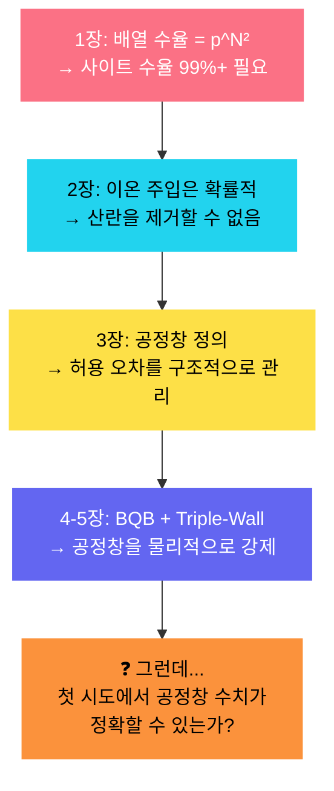

현실에서는 첫 번째 시도에서 공정창을 완벽하게 맞추는 것이 불가능합니다. 시뮬레이션과 실제 사이에는 항상 차이가 있고, 그 차이를 **데이터로 학습하여 줄여나가야** 합니다.

### 6.2 Generate → Verify → Correct

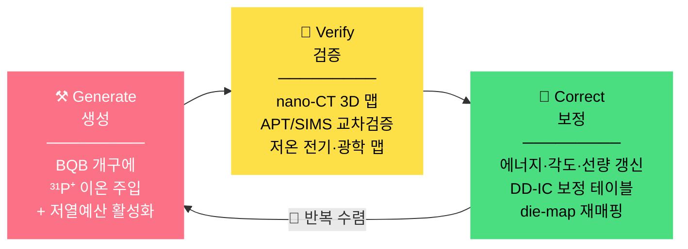

### 6.3 각 단계의 도구와 산출물

<details open>
<summary><b>⚒️ Generate (생성)</b></summary>
<br/>

| 항목 | 상세 |
|:---:|------|
| **입력** | BQB 템플릿 (개구 좌표 + 장벽 깊이) |
| **공정** | 이온주입기 기반 ³¹P⁺ 면적 조사(5~30 keV) + BQB 자기정렬 개구부로 위치 결정(기본), FIB 단일 이온 주입은 선택 옵션 + 저열예산 활성화 (Flash/Laser spike/RTA) |
| **핵심 제약** | 열예산을 엄격히 제한하여 도너 확산 최소화. BQB-B 장벽이 확산 차단 역할도 수행 |
| **산출물** | Q 생성 웨이퍼 (도너 위치 미확인 상태) |

</details>

<details open>
<summary><b>🔬 Verify (검증)</b></summary>
<br/>

| 검증 도구 | 무엇을 측정하는가 | 왜 필요한가 |
|---------|----------------|----------|
| **nano-CT / XRD-CT** | 3D 구조·변형 분포 비파괴 맵 | BQB 장벽의 3D 형상과 도너 위치를 직접 확인 |
| **APT** (원자단층현미경) | 3D 원자 위치 직접 매핑 | 도너의 정확한 격자 위치를 원자 수준에서 검증 |
| **SIMS** | 깊이 방향 조성 프로파일 | 채널링 tail이 얼마나 절단되었는지 정량 확인 |
| **TEM** | 단면 구조/결함 이미지 | 장벽 계면 품질, 격자 손상 여부 확인 |
| **저온 전기·광학 맵** | 큐비트 동작 특성 | 전하 안정성, 주파수 분포, 결맞음 시간 |

**산출물**: 3D 도너 좌표 맵 + 전하 환경 맵 + 공정창 준수 여부 판정

</details>

<details open>
<summary><b>🔧 Correct (보정)</b></summary>
<br/>

매 회전의 보정 단계에서 **4가지 정량 산출물**이 갱신됩니다:

| # | 산출물 | 내용 |
|:-:|-------|------|
| ① | **공정창 허용치** | 각 축의 허용 범위를 실측 기반으로 수정 |
| ② | **outlier 모델** | 이탈 원인을 분류하고 확률을 정량화 |
| ③ | **die-map 재매핑** | 웨이퍼 내 위치별 보정 계수 |
| ④ | **보정 테이블** | DD-IC 게이트 전압 등 운용 조건 업데이트 |

</details>

### 6.4 수렴의 정량적 의미

> [!NOTE]
> 아래 표는 거듭제곱 법칙에서 역산한 **개념적 예시**입니다. 실제 수렴 속도는 공정 조건에 따라 달라지며, 제안서는 "2~3회전 내 수렴"과 "site yield ≥ 90%(목표)"를 제시합니다.

<div align="center">

| 회전 | 공정창 이탈률 | 사이트 수율 | 16×16 배열 수율 | 판정 |
|:---:|:---------:|:---------:|:-------------:|:---:|
| 초기 | 높음 | 낮음 | ≈ 0% | 🔴 |
| 2~3회전 | 감소 | ≥ 90%(목표) | 배열 수율 상승 | 🟡 |
| 수렴 후 | <1% | ≥ 99%+ | 유의미한 배열 수율 | 🟢 |

</div>

> [!TIP]
> **이것이 "공정 분리형 통합 전략"과 직결됩니다.** Q 생성을 후공정으로 분리해야 이 반복 수렴이 **비용-효율적으로 가능**해집니다. → 7장에서 설명합니다.

<details>
<summary><b>🧪 자기 점검 (클릭하여 열기)</b></summary>
<br/>

**Q:** 폐루프가 효과적이려면, Q(큐비트) 생성을 파운더리 공정과 분리해야 하는 이유가 무엇인가요?

**A:** 분리하지 않으면 매 회전마다 **파운더리 비용을 다시 지불**해야 합니다. 분리하면 동일한 칩 위에서 Q 생성만 반복할 수 있어, 반복 비용이 급감합니다.

</details>


## 7. 🏗️ 전체 아키텍처 — 왜 이 구조여야 하는가

### 7.1 공정 분리형 통합 전략

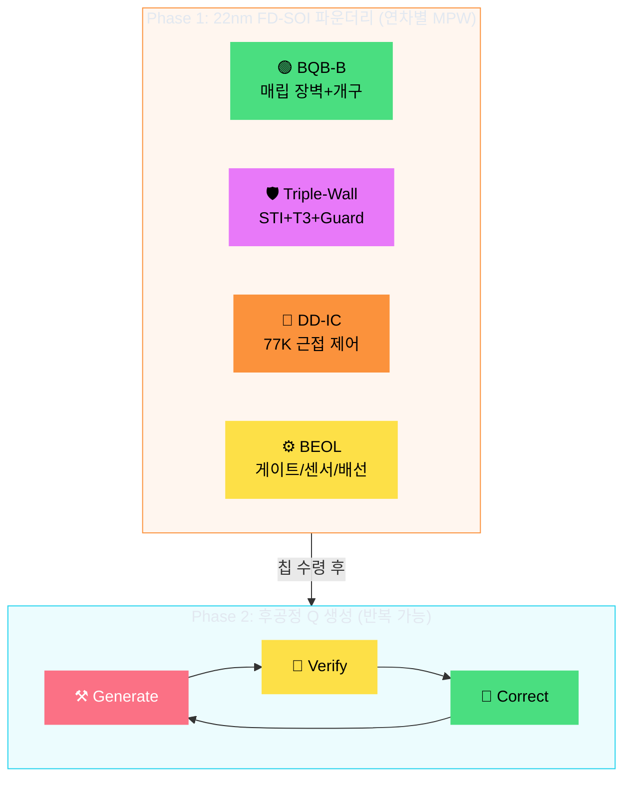

**Phase 1**은 상용 파운더리에서 **연차별 MPW(1~5차)** 로 제작합니다. **Phase 2**는 수령한 칩 위에서 Q 생성을 **반복**합니다. 매 연차 폐루프 산출물이 다음 연차 MPW 설계에 반영됩니다.

<div align="center">

| 분리의 이유 | 설명 |
|:---------:|------|
| 🔥 **오염/열예산 격리** | 이온 주입·활성화의 오염·열 리스크를 파운더리 공정으로부터 완전 분리 |
| 🔄 **반복 최적화** | Q 생성만 반복 → 파운더리 비용 재지불 없이 공정창 수렴 가능 |
| 📐 **스케일 확장** | BQB 타일 + DD-IC를 동일 PDK/DRC 룰로 검증 → 배열 면적 확대 시 레이아웃 리스크 최소화 |

</div>

### 7.2 DD-IC 근접 제어 — 배선 병목 해결

배열이 커지면 또 다른 병목이 발생합니다: **배선 fan-out**.

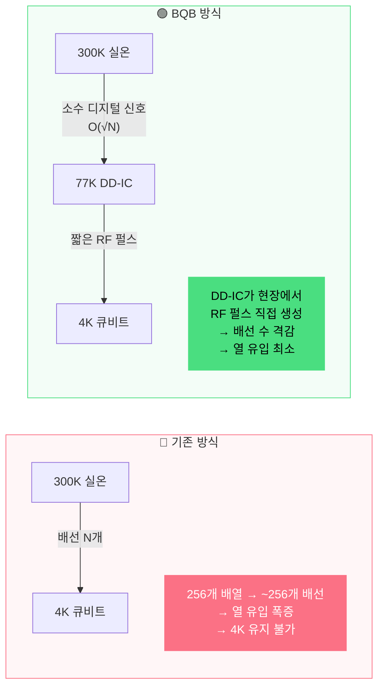

77K DD-IC가 하는 일:
- 300K에서 수신한 **디지털 명령**을 해석
- 큐비트에 필요한 **RF 제어 펄스를 77K 현장에서 직접 생성**
- 채널 간 **스큐(skew) ≤ 5ps**, 지터 보정
- broadcast(공유 버스) + 선택 구동으로 **배선 복잡도 O(√N)**

### 7.3 Split-Stage 패키징

```
 ┌──────────────────────────────────────────────────┐
 │                    300K (실온)                      │
 │   외부 AWG + PLL (고수준 디지털 명령 생성)            │
 └──────────────────┬───────────────────────────────┘
          소수의 디지털 신호선 ↓ (열 유입 최소)
 ┌──────────────────┴───────────────────────────────┐
 │               77K Deck (1st Stage)                 │
 │   DD-IC: 온칩 LO-PLL/DCO + 이벤트 시퀀서            │
 │   → 다채널 DD 펄스 현장 생성                          │
 │   → 스큐/지터 보정 (≤ 5ps RMS)                      │
 │   → 발열 ≤ 0.8W/칩 → 77K 스테이지에서 방열           │
 └──────────────────┬───────────────────────────────┘
          짧은 RF 펄스 라인 ↓ (짧은 거리 → 감쇠 최소)
 ┌──────────────────┴───────────────────────────────┐
 │                4K Deck (2nd Stage)                  │
 │   QPU: 큐비트 배열 + 인터포저                         │
 │   → 최소 열 유입 환경에서 큐비트 동작                   │
 └──────────────────────────────────────────────────┘
```

### 7.4 전체 논리의 인과관계 — 한 줄로 연결

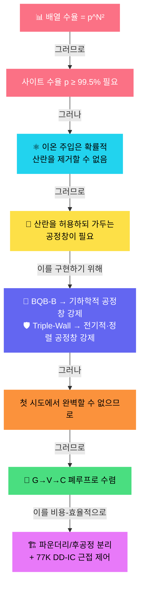

> [!IMPORTANT]
> **모든 것이 1장의 거듭제곱 공식 `Y = p^(N²)` 에서 출발합니다.**
>
> BQB는 "더 좋은 큐비트"를 만드는 기술이 아닙니다.
> N² 사이트의 동시 공정창 충족이라는 정량적 요구를,
> **물리적 구조와 반복 수렴 체계로 강제하는 프레임워크**입니다.


## 🔤 핵심 용어 정리

<details>
<summary><b>📖 클릭하여 펼치기</b></summary>
<br/>

| 용어 | 정의 | 이 가이드에서의 맥락 |
|------|------|------------------|
| **Straggle (σ)** | 이온 정지 위치의 통계적 분산 | 사이트 수율을 깎는 직접적 원인 (2장) |
| **Channeling** | 결정 채널을 따른 비정상적 깊이 침투 | 비가우시안 tail → 공정창 이탈의 주범 (2장) |
| **공정창 (Process Window)** | 큐비트 정상 동작을 위한 다차원 허용 오차 공간 | BQB 설계 전체의 기준 규격 (3장) |
| **BQB-B** | Buried Quantum Barrier - Barrier | 기하학적 공정창을 물리적으로 강제하는 매립 장벽 (4장) |
| **STI** | Shallow Trench Isolation | Triple-Wall의 Wall-1: 기판 커플링 차단 (5장) |
| **T3** | True Triple Well | Triple-Wall의 Wall-2: 전기적 실드 (5장) |
| **D\_it** | 계면 트랩 밀도 (interface trap density) | 전기적 공정창의 핵심 파라미터 (3장) |
| **\|∇E\|** | 국부 전계 기울기 | valley splitting 변동 → 큐비트 주파수 변동 (3, 5장) |
| **DD-IC** | Dynamic Decoupling Pulse Generator IC | 77K 근접 제어로 배선 병목 해결 (7장) |
| **FD-SOI** | Fully Depleted Silicon-On-Insulator | 22nm급 상용 반도체 공정 플랫폼 (7장) |
| **overlay** | 다층 리소그래피 간 정렬 오차 | 정렬 공정창의 핵심 파라미터 (3장) |
| **RTA** | Rapid Thermal Anneal | 저열예산 활성화 — 도너 확산 최소화 (6장) |
| **APT** | Atom Probe Tomography | 3D 원자 위치 직접 매핑 — 검증 도구 (6장) |
| **SIMS** | Secondary Ion Mass Spectrometry | 깊이 방향 조성 분석 — 채널링 tail 확인 (6장) |

</details>


## 🗺️ 난이도 맵

<div align="center">

```
초급 (Beginner)          ← 이전 가이드: 비유 중심, 사전 지식 불요
━━━━━━━━━━━━━━━━━━━━━━━━━━━━━━━━━━━━
◆ 중급 (Intermediate)    ← 현재 가이드: 물리 → 설계 → 검증의 인과관계
━━━━━━━━━━━━━━━━━━━━━━━━━━━━━━━━━━━━
고급 (Advanced)          → 다음: TCAD 시뮬레이션, 공정 레시피 상세,
                                 DD-IC 회로 설계, 2H-Si 도전형 경로
```

</div>

---

<!-- ═══════════════════ FOOTER ═══════════════════ -->
<div align="center">


<br/>


<br/>

*이 가이드는 제안서 원문의 물리적 메커니즘과 설계 원리를 중급 수준으로 재구성한 것입니다.*
*정확한 기술 사양은 제안서 원문을 참조하시기 바랍니다.*

<br/>


</div>
